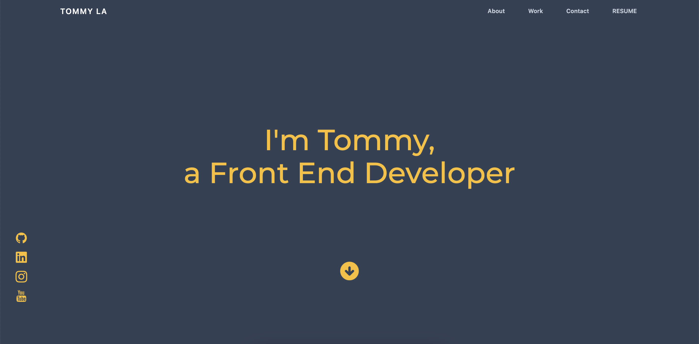

# My React Portolio

Creating a portfolio using React.js

## Description 

A portfolio that is created by using React.js and TailwindCSS framework. 

## Application Preview

## Deployed Application

- [Deployed on Netlify](https://tommymla.com/)

## Sections

- About Me
- Work
- Contact
- Downloadable Resume

## What was used in this project?

- [TailwindCSS](https://tailwindcss.com/)
- [React.js](https://reactjs.org/)

## Contact

- [Portfolio](https://tommymla.com/)
- [LinkedIn](https://www.linkedin.com/in/tommymla/)
- [My GitHub](https://github.com/latommyla)
- [My Email](mailto:tommyl.dmd@gmail.com)
- [Instagram](https://instagram.com/latommyla)